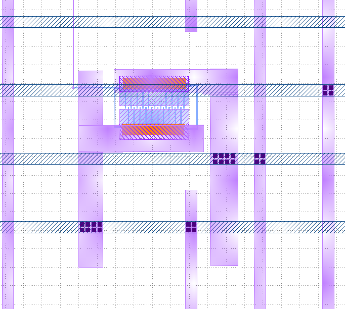

# Including an Analog design in Caravel User Project

I made a simple PFET with Magic's pcells, and then wired it to short power and ground when the gate is driven low.

* Power and Ground connections must be on metal 4.
* Ports must be created correctly (see below) for each type of signal

# Magic

Start magic like this:

    magic -d XR power_switch.mag -rcfile sky130A.magicrc 

After drawing the MOSFET and labelling the ports with the menu text -> label option, I used these commands
to create the ports and write the lef & gds.

    port gate use signal
    port vss use ground
    port vcc use power

    port vss class input
    port vss class inout
    port vcc class inout

    lef write -hide
    gds write power_switch.gds

# Install instructions

copy these files to the following subdirectories inside caravel_user_project:

* power_switch.gds -> ./gds/
* power_switch.lef -> ./lef/
* macro.cfg -> ./openlane/user_project_wrapper/
* config.json -> ./openlane/user_project_wrapper/
* user_project_wrapper.v -> ./verilog/rtl/
* power_switch.v -> ./verilog/rtl/

run

    make user_project_wrapper

And the MOSFET should get included like this:

